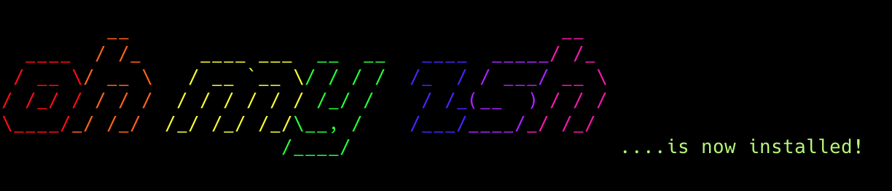

# ZSH y Oh-My-ZSH

> Guía para instalar ZSH + Oh-My-ZSH con plugins y temas personalizados.

---

## Tabla de Contenidos

1. [ZSH](#zsh)
2. [Oh-My-ZSH](#oh-my-zsh)
3. [Plugins Disponibles](#plugins-disponibles)
4. [Temas](#temas)

---

## ZSH

**ZSH** Es un intérprete de comandos, es una versión mejorada de **Bash**, ofreciendo más funcionalidades y personalización.

### Ventajas principales:
- Mayor eficiencia y velocidad
- Completado de tabulador mejorado (autocompletado inteligente)
- Expansión de nombres de fichero mejorada
- Manejo de arrays más potente
- Totalmente personalizable

### Instalación (simple)

#### macOS
Zsh ya viene instalado. Para confirmar y usarlo:

```bash
echo $0
```

Si quieres dejarlo como predeterminado:

```bash
chsh -s /bin/zsh
```

Cierra y vuelve a abrir la Terminal.

#### Windows (con WSL)
1. Instala WSL:

```bash
wsl --install
```

2. Abre Ubuntu y ejecuta:

```bash
sudo apt update
sudo apt install zsh
```

3. Cambia el shell a Zsh:

```bash
chsh -s /usr/bin/zsh
```

#### Linux

Ubuntu/Debian:

```bash
sudo apt update
sudo apt install zsh
```

Fedora/RHEL:

```bash
sudo dnf install zsh
```

Arch:

```bash
sudo pacman -S zsh
```

**Verificar instalación:**

```bash
zsh --version
```

**Verificar que estás usando Zsh:**

```bash
echo $SHELL
```


---

## Oh-My-ZSH

**Oh-My-ZSH** es un framework que facilita la instalación y gestión de plugins y temas para ZSH.

### Instalación 

#### macOS
Zsh ya viene instalado. Ejecuta el instalador de Oh-My-Zsh:

```bash
sh -c "$(curl -fsSL https://raw.githubusercontent.com/ohmyzsh/ohmyzsh/master/tools/install.sh)"
```

Si te pregunta, acepta cambiar el shell a Zsh.




#### Windows (con WSL)
1. Instala WSL y abre Ubuntu.
2. Asegúrate de tener Zsh instalado:

```bash
sudo apt update
sudo apt install zsh
```

3. Instala Oh-My-Zsh:

```bash
sh -c "$(curl -fsSL https://raw.githubusercontent.com/ohmyzsh/ohmyzsh/master/tools/install.sh)"
```

#### Linux
Ubuntu/Debian:

```bash
sudo apt update
sudo apt install zsh
```

Fedora/RHEL:

```bash
sudo dnf install zsh
```

Arch:

```bash
sudo pacman -S zsh
```

Luego instala Oh-My-Zsh:

```bash
sh -c "$(curl -fsSL https://raw.githubusercontent.com/ohmyzsh/ohmyzsh/master/tools/install.sh)"
```

**Si quieres recargar la configuración:**

```bash
source ~/.zshrc
```

---

## Plugins Disponibles


Luego, actualiza la configuración:
```bash
source ~/.zshrc
```

---

### Git Plugin

**Viene incluido en Oh-My-ZSH**. Para activarlo, agrega `git` a la lista de plugins en tu archivo `~/.zshrc`.

**Pasos (detallado y simple):**
1. Abre el archivo de configuración:

```bash
nano ~/.zshrc
```

2. Busca la línea `plugins=(...)` y agrega `git` dentro. Ejemplos:

```zsh
plugins=(git)
```

```zsh
plugins=(git docker-compose zsh-autosuggestions)
```

3. Guarda y recarga la configuración:

```bash
source ~/.zshrc
```

**Comprobar que funciona:**
```bash
gst
```

| Alias | Comando | Descripción |
|-------|---------|-------------|
| `ga` | `git add` | Agregar archivos al stage |
| `gaa` | `git add --all` | Agregar todos los archivos |
| `gb` | `git branch` | Listar ramas |
| `gcmsg` | `git commit -m` | Hacer commit con mensaje |
| `gco` | `git checkout` | Cambiar de rama |
| `ggl` | `git pull origin $(rama_actual)` | Pull de la rama actual |
| `ggp` | `git push origin $(rama_actual)` | Push de la rama actual |
| `glo` | `git log --oneline --decorate` | Ver historial de commits |
| `gra` | `git remote add` | Agregar repositorio remoto |
| `grv` | `git remote -v` | Ver repositorios remotos |
| `gst` | `git status` | Ver estado del repositorio |
| `gss` | `git status -s` | Ver estado resumido |

[Documentación completa](https://github.com/ohmyzsh/ohmyzsh/tree/master/plugins/git)

---

### Docker Compose Plugin

Aliases para **Docker Compose**.

**Activar:**
```zsh
plugins=(
  docker-compose
)
```

| Alias | Comando | Descripción |
|-------|---------|-------------|
| `dcb` | `docker-compose build` | Construir contenedores |
| `dce` | `docker-compose exec` | Ejecutar comando en contenedor |
| `dcr` | `docker-compose run` | Ejecutar comando |
| `dcstop` | `docker-compose stop` | Detener contenedores |
| `dcup` | `docker-compose up` | Iniciar servicios |
| `dcdn` | `docker-compose down` | Detener y remover |
| `dcstart` | `docker-compose start` | Iniciar contenedores |

[Documentación completa](https://github.com/ohmyzsh/ohmyzsh/tree/master/plugins/docker-compose)

---

### Laravel Sail Plugin

Plugin para facilitarinteracción con **Laravel Sail**.

**Instalación:**
```bash
git clone https://github.com/ariaieboy/laravel-sail \
  ${ZSH_CUSTOM:-~/.oh-my-zsh/custom}/plugins/laravel-sail
```

**Activar:**
```zsh
plugins=(laravel-sail)
```

| Alias | Comando | Descripción |
|-------|---------|-------------|
| `s` | `sail` | Ejecutar sail |
| `sup` | `sail up` | Iniciar servicios |
| `sud` | `sail up -d` | Iniciar en segundo plano |
| `sdown` | `sail down` | Detener servicios |
| `sb` | `sail build` | Construir imagen |
| `sa` | `sail artisan` | Ejecutar artisan |
| `sp` | `sail php` | Ejecutar PHP |
| `sc` | `sail composer` | Ejecutar composer |
| `sn` | `sail npm` | Ejecutar npm |

[Documentación completa](https://github.com/ariaieboy/laravel-sail)

---

### zsh-Syntax-Highlighting Plugin

Resalta comandos mientras escribes. **Altamente recomendado**.

**Colores:**
- Verde: comando válido
- Rojo: comando no válido
- Azul: ruta válida

**Instalación:**
```bash
git clone https://github.com/zsh-users/zsh-syntax-highlighting.git \
  ${ZSH_CUSTOM:-~/.oh-my-zsh/custom}/plugins/zsh-syntax-highlighting
```

**Activar:**
```zsh
plugins=(zsh-syntax-highlighting)
```

> Tip: Debe ser el último plugin en la lista para funcionar correctamente.

---

### zsh-Autosuggestions Plugin

Sugiere comandos basados en tu historial mientras escribes. **Altamente recomendado**.

**Instalación:**
```bash
git clone https://github.com/zsh-users/zsh-autosuggestions \
  ${ZSH_CUSTOM:-~/.oh-my-zsh/custom}/plugins/zsh-autosuggestions
```

**Activar:**
```zsh
plugins=(zsh-autosuggestions)
```

**Uso:**
- Aparecen sugerencias en gris mientras escribes
- Presiona `→` (flecha derecha) para aceptar la sugerencia completa
- Presiona `Ctrl + →` para aceptar una palabra de la sugerencia
- Presiona `Esc` para ignorar la sugerencia

---

## Temas

### Powerlevel10k

**Powerlevel10k** es el tema más popular. Ofrece un prompt hermoso y personalizable.

**Instalación:**
```bash
git clone --depth=1 https://github.com/romkatv/powerlevel10k.git \
  ${ZSH_CUSTOM:-$HOME/.oh-my-zsh/custom}/themes/powerlevel10k
```

**Configurar en `~/.zshrc`:**
```zsh
ZSH_THEME="powerlevel10k/powerlevel10k"
```

**Personalizar:**
```bash
p10k configure
```

Esto abrirá un asistente interactivo para configurar la apariencia del prompt.
[Documentación completa](https://github.com/romkatv/powerlevel10k)


### Comandos útiles de Oh-My-ZSH:

**Actualizar Oh-My-ZSH:**
```bash
omz update
# o 
upgrade_oh_my_zsh
```

**Reiniciar ZSH completamente:**
```bash
exec zsh
```

**Desinstalar Oh-My-ZSH:**
```bash
uninstall_oh_my_zsh
```